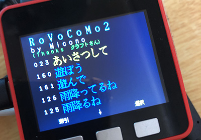

# M5Stack_RoVoCoMo2 (v2.1)
ロビ１、ロビ２をWi-Fi（FlashAirを使用）またはBLE (Bluetooth Low Enagy)により無線コントロールするための**M5Stack**および**Odroid-GO**のプログラムです。RoVoCoMo2という名前は「Robi Voice Controller by Micono」の略で、ブラウザ版の[RoVoCoMo](http://micono.cocolog-nifty.com/blog/2017/07/rovocomo-v05-81.html)のM5Stack/Odroid-GO版をRoVoCoMo2としています。[LovyanLauncher](https://github.com/lovyan03/M5Stack_LovyanLauncher)に対応していて、microSDからの起動には[LovyanLauncher](https://github.com/lovyan03/M5Stack_LovyanLauncher)もインストールされている必要があります。

**注意：Odroid-GO Device Menu Control (以降、OGメニュー）を使う場合（初期状態の場合）は[LovyanLauncher](https://github.com/lovyan03/M5Stack_LovyanLauncher)のインストールは必要はありません。microSDには[Skeleton file](https://wiki.odroid.com/odroid_go/make_sd_card)を使います。**

どのようなプログラムなのかは、以下の像をクリックすると操作中の動画をで観ることができます（**この動画で使っているRoVoCoMo2は旧バージョンであり最新バージョンのものとは異なります**）。 

### 更新内容

**v2.1**

- fwタイプのバイナリを追加
- Fireパーティションバイナリーを追加
- 認識語や発話語を切り替えられるようになった
- 十字キーの左右で５個おきに表示を切り替えられるようになった（Odroid-GOまたはfaces）
- Volumeボタンで、音量を0,小(1),大(5)に変えられるようになった（Odroid-GO）

	[v2.1最新機能動画](https://youtu.be/hLVhZwFGAmI )

##### v2.1への更新方法

- microSDの中に入っている古いバージョンのRoVoCoMo2.binファイルを消去またはRoVoCoMo2.2.0.binなどと名前を変更して下さい。
- ダウンロードしたファイルの中の「microSD」フォルダの中のファイルをmicroSDにコピーします。**重複するフォルダがある場合は結合コピーでコピーしないとフォルダの中に入っている他のプログラムが消えてしまうので十分にご注意ください。**
- 音声リストのcsvファイルが新しくなっていますので、必ずコピーして下さい。

## インストール
**このページ右上の方にある「Clone or download」（緑色のボタン）でDownload ZIPを選び、ダウンロードし、zipを解凍して以下の手順に従ってインストールを行ってください。**

### ① 無線対応の「ロビのココロ」を作る
ロビのココロ (microSD) をFlashAirやBLEを使って動かすためには、それら対応のロビのココロを作成する必要があります。コントーロルの仕様は、メディアクラフトさんの仕様に合わせる形で対応しています。したがって、**ここでの作業は、主にメディアクラフトさんのページを参考に行って下さい。**

#### A: ロビ2の場合
**STARTUP.BINをBLEまたはFlashAir対応に変換する** 
メディアクラフトさんの「[ロビ設定ファイルエディタ２](http://www.kumagaya.or.jp/~mcc/robox/RBEdit2/index.html)」を使って、ロビ２のココロに入っている**STARTUP.BINを無線対応に書き換えてください**。以下は、ロビ設定ファイルエディタ２のページからの抜粋です。クラフトさんのページで使われている「リモート接続」や「リモート操作」とは、「BLEやFlashAirを使った接続」や「操作」と考えて下さい。

- **リモート対応**をチェックすると**FlashAir**によるリモート接続に対応できます。
- **Bluetooth**にチェックするとQ-boやM5Stack、および、Odroid-GOでリモート操作ができます。
- Bluetooth開始コードは、**RoVoCoMo2**の場合は**「1154」**が開始コードとなります。
- ロビ２用のココロの改善プログラムを使っている場合は、[ロビ設定ファイルエディタ２](http://www.kumagaya.or.jp/~mcc/robox/RBEdit2/index.html)の最新のものを使って下さい。

ロビ設定ファイルエディタ２はWindows版のアプリケーションです。マックをお使いでSTARTUP.BINを作れない場合は、miconoまでご連絡下さい。なお、マック版の同様のプログラムを作成を計画していますが、いつごろになるか未定です。

なお、[FlashAir](http://www.kumagaya.or.jp/~mcc/robox/RBPlayer/index.html#FLASHAIR)自体の設定方法は、こちらを参考にして下さい。

#### B:ロビ1の場合 ***(FlashAir対応のロビのココロを作る)***
ロビをFlashAirを使って無線コントロールする方法がクラフトさんのサイトで公開されていますの で、以下のページを参考にFlashAir対応のロビのココロを作成して下さい。

1. 以下のURLの**リモート接続用ロビプログラム**をダウンロードして、ロビのココロの書き換えなどを行なって下さい。 
[リモート接続用ロビプログラム](http://www.kumagaya.or.jp/~mcc/robox/RBMotion/index.html#REMOTE_DOWNLOAD)

2. 以下のURLの「**FlashAirの設定**」を参考にFlashAirの設定を行なって下さい。 
 [FlashAirの設定](http://www.kumagaya.or.jp/~mcc/robox/RBPlayer/index.html#FLASHAIR)
 
- FlashAirのSSIDとパスワードは、SSIDがflashair_xxxxxで、パスワードが12345678の 場合に自動的に接続できるようになっています(xxxxxの部分は任意の文字)。買った状態 のSSIDとパスワードはこの設定になっています。
- もしSSIDやパスワードが上の条件になっていない場合は、エディタでSSIDとパスワード をカンマで区切って書いて、flaap.txtと言う名前でM5Stackに入れるmicroSDに保存して ください。起動時にそのファイルを最初に検索する仕様になっています。
 
 
### ② M5Stack（またはOdroid-GO）のmicroSDに入れるもの
1. ダウンロードしたファイルの中にある「microSD」フォルダの中のファイルをすべてmicroSDにコピーします。**重複するフォルダがある場合は結合コピーでコピーしないとフォルダの中に入っている他のプログラムが消えてしまわないように、ご注意ください。**
2. 次に、RoVoCoMo2が使っている**日本語フォント**（**FONT.BIN**, **FONTLCD.BIN**)を以下の手順でmicroSDに入れます。
	- [Tamakichi/Arduino-KanjiFont-Library-SD](https://git.io/fjYst)を開いて下さい。
	- 「**Clone or download**」から**Download ZIP**を選び、ダウンロードされたzipファイルを解凍します。
	- **fontbinフォルダ**の中の、**FONT.BIN**と**FONTLCD.BIN**の２つのファイルをmicroSDにコピーして下さい。

### ③ USBドライバーをインストールする
M5Stackをコンピュータと繋いで、プログラムの転送など通信するためには、Silicon LabsのUSBDriverをインストールする必要があります。もしまだインストールしてなければ
[シリアル接続の確立方法](https://docs.m5stack.com/#/ja/related_documents/establish_serial_connection)
のサイトを参考にしてインストールして下さい。**Odroid-GOメニューを使う場合は必ずしもドライバーのインストールをする必要はありません**

> なお、Macの場合、インストールしただけではセキュリティが通ってないので、インストール後、環境設定のセキュリティとプライバシーの一般で、インストールしたドライバーの許可をして下さい。
> 

### ④ M5Burner_Micで、LovyanLauncherをインストールする
**Odroid-GOメニューを使う場合はこの操作を行ってはいけません!!!**

"[M5Burner_Mic](https://github.com/micutil/M5Burner_Mic)"というプログラムで[LovyanLauncher](https://github.com/lovyan03/M5Stack_LovyanLauncher)をM5StackまたはOdroid-GOにインストールする方法を説明します。

1. [M5Burner_Mic](https://github.com/micutil/M5Burner_Mic) のページから「Download [here](http://micutil.com/download/M5Burner_Mic.zip)」の所でM5Burner\_Micをダウンロードし、解凍して下さい。M5Burner\_Micフォルダはお好みの場所に入れて下さい（**フルパスに日本語名を含まない場所に置くのが無難です**）。
2. M5Stackにインストールする場合：[LovyanLauncher firmware](https://github.com/lovyan03/LovyanLauncher-firmware)のページから「Clone or download」のボタンでダウンロードし解凍。LovyanLauncher-firmware-masterフォルダをM5Burner\_Micのフォルダの中にあるfirmwaresフォルダにコピーして下さい。
3. Odroid-GOにインストールする場合：[Odroid-GO版のLovyanLauncher](https://github.com/lovyan03/M5Stack_LovyanLauncher/blob/master/LovyanLauncher/build_odroid_go/LovyanLauncher.bin)のページの「Download」ボタンをクリックするとダウンロードできます。ダウンロードしたLovyanLauncher.binは、M5Burner\_Mic起動後、M5Burner\_Micのウインドウに**ドラッグ＆ドロップ**して下さい。
2. USBケーブルでパソコンとM5StackまたはOdroid-GOを繋げて下さい。
3. M5Burner\_Micをダブルクリックして起動します。
4. USBシリアルポートをM5StackまたはOdroid-GOのポートに設定します。
 - Macの場合はポートに名前がつくので「**SLAB_USBtoUART**」という名前のポートを選んで下さい。
 - Windowsの場合は、**COM3**とか、COM4とかの名前になっています。ひとつしか表示されてなかったら、それがM5Stackのポートでしょう。もしいくつか表示されているようだったら、コントロールパネルから、デバイスマネージャーのポートをみて番号を確認して下さい。例えば以下の図の場合だと**COM4**であるということになります。 
5. 「Priset」のポップアップメニューで「**LovyanLauncher......**」を選択します。
6. 「**Start**」ボタンをクリックすると、プログラムの転送が開始します。
7. プログラムの転送が終わるとM5StackまたはOdroid-GOは、リセットされ、インストールした**LovyanLauncher**が起動します。

#### LovyanLauncherの操作
	1. メニューの**SD-Updater**を選択して"OK"
	2. microSDに入ってるプログラムの一覧が表示されます。
	3. 目的のプログラムを探して選択し、"OK"
	4. 起動する場合は、"Execute"

#### ODROID-GO Device Firmware Menu Controlsの操作

	1. 電源スイッチ OFF
	2. Bボタンを押したまま, 電源スイッチ On
	3. メニューが表示されたらBボタンを離す

	アプリケーションF/Wの起動
	- A ボタン: アプリケーションF/Wを選択
	- B ボタン: キャンセル
	- Start ボタン: アプリケーションF/Wの書き込み

## RoVoCoMo2の操作方法

### 基本操作
**M5Stackの場合：** 左から、Aボタン、Bボタン、Cボタン

- **A+Bボタン**で音声を選択します（ロビ２認識語→ロビ語音声１→ロビ語音声２→ロビ語音声３→ロビ語音声４→ロビ１認識語→）。
- **索引(Cボタン)**を押して、50音表示にします。
- **右矢印(Cボタン)または下矢印(Aボタン)**を押して、動作させたい認識語の頭文字を選択します。例えば「ゲームしよう」を選びたい場合は「げ」を選択して、**「選択」(Bボタン)**を押します。
- 認識語の一覧が黄色く表示されているので、**下矢印(Aボタン)**で動作させる音声を選択します。
- **「選択」(Bボタン)**で、それに対応する信号が送信され、ロビが動作を開始します。
- ロビ２のみの音声はIDが**赤色**で表示されます。

**Odroid-GO / Facesの場合**

- **Selectボタン**で音声を選択します（ロビ２認識語→ロビ語音声１→ロビ語音声２→ロビ語音声３→ロビ語音声４→ロビ１認識語→）。
- **索引(Aボタン)**を押して、50音表示にします。
- **十字キーの上下左右**を押して、動作させたい認識語の頭文字を選択します。例えば「ゲームしよう」を選びたい場合は「げ」を選択して、**「選択」(Bボタン)**を押します。
- 認識語の一覧が黄色く表示されているので、**十字キーの上下左右**で動作させる音声を選択します。左右ボタンは音声リストは５つずつ進みます。
- **「選択」(Bボタン)**で、それに対応する信号が送信され、ロビが動作を開始します。
- ロビ２のみの音声はIDが**赤色**で表示されます。

### 電源・リセット
**M5Stackの場合：**
- **AボタンとCボタン**を同時に押してると電源を切ることができます。
- 左側面の赤いボタンがリセットボタンです。
- Aボタンを押したままリセットをすると、メニュープログラムを起動させられます。
- **Bボタン**を押したまま起動すると、FlashAir機能がオフになります。
- **Cボタン**を押したまま起動すると、音声再生がオフになります。
- 約5分程度時間が経つとスリープします。**Bボタン**で復帰します。

**Odroid-GO / Facesの場合**
- ODメニューを起動する場合は、**Bボタン**を押したままスイッチオンにするとメニュー画面になります。

### 特別な操作(ロビライドの操作)
- ロビ2でロビライドモードに入る時は「ロビライドで遊ぼう」です。その操作後に、ロビ2のロビライド用の認識語一覧が表示されます。
- ロビ1でロビライドモードに入る時は「遊ぼう」です。その操作後に、ロビ1のロビライド用の認識語一覧が表示されます。終了する「だいじょうぶ」も再生/リモート送信されます。
- ロビライドモードに入ると、M5Stackでは、**上矢印(Cボタン)または下矢印(Aボタン)**で、Odroid/Facesでは、**十字キーの上下**で、認識語を選択できるようになります。

### その他
- FlashAirのSSIDとパスワードは、SSIDがflashair_xxxxxで、パスワードが12345678の場合に自動的に接続できるようになっています(xxxxxの部分は任意の文字)。買った状態のSSIDとパスワードはこの設定になっています。
- SSIDやパスワードが上の条件になっていない場合は、エディタでSSIDとパスワードをカンマで区切って書いてflaap.txtと言う名前でmicroSDに保存してください。起動時にそのファイルを最初に検索する仕様になっています。
- 複数個のFlashAirの電波があった場合、いちばん電波の強いFlashAirに接続する仕様になっていますので、起動時に接続させたいFlashAirの近くで起動させて下さい。
- ID434「今何時」、ID238「だいじょうぶ」及び ID168「ゲームしよう」は、ロビ２でなくなった認識語のため、ロビ２では無反応です。これらは、ロビ２用のNinshiki.csvでロビ１も操作できるように入れてあります。
- 「ゲームしよう」はロビ２のガイドの間違い(おそらく「ゲームする」との)で音声認識語ファイルも提供されていません。ロビ２に「ゲームしよう」と言っても反応しません(ゲームすると誤認識した反応する事もあります)。この認識語はロビ１でも重要な認識語ではなのでロビ２用のNinshiki.csvから除外してあります。

## 履歴
	ver 2.1: 2019/ 9/28 : 音声リスト切替機能ほか
	ver 2.0: 2019/ 5/17 : Odroid-GO対応 / Faces操作不具合修正
	ver 1.9: 2019/ 4/30 : FlashAirを使った場合の落ちる不具合を修正
	                      Ninshikiフォルダが入ってない場合、音声がでない不具合を修正
	               5/ 4 : ロビ２用Ninshiki.csvの不具合等の修正
	ver 1.8: 2019/ 4/23 : CSVファイル改良（容量軽減）
	ver 1.7: 2019/ 4/14 : ロビ２のココロ対応
	ver 1.6: 2019/ 3/28 : 認識語リスト外部ファイル化
	ver 1.5: 2019/ 3/ 8 : ロビライドの操作性ほか
	ver 1.4: 2019/ 3/ 5 : FlashAir対応
	ver 1.3: 2019/ 2/24 : 50音索引化
	ver 1.2: 2019/ 1/27
	ver 1.1: 2019/ 1/25
	ver 1.0: 2019/ 1/ 6

## 免責およびライセンス

CC 4.0 BY-NC-ND https://github.com/micutil/M5Stack_RSTester

- なお、現在、特に開発段階であるため、このアーカイブに含まれるすべてのファイル等に関して、無断で、転載、掲載、変更の禁止など、動作テスト以外のすべての行為を禁じます。
- これらを使ったことにより生じるいかなるトラブルに関しても自己責任においておこなって下さい。
- お問い合わせ等は、miconoまで、メールなどをください。

謝辞：RoVoCoMo2は、メディアクラフトさん（http://www.kumagaya.or.jp/~mcc）が
おこなった、ロビのココロなどの解析によりはじめて実現できたものです。この場をお借りしてお礼を申し上げます。
